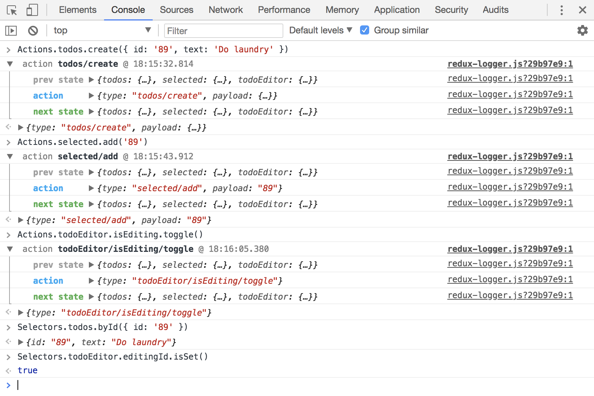

<br>
<p align="center"></p>
<h1 align="center">
  Redux Enterprise
  <br>
  <br>
</h1>

<p align="center">
  <a href="https://travis-ci.org/redux-enterprise/redux-enterprise"></a>
  <a href="https://www.npmjs.com/package/redux-enterprise"></a>
  <a href="https://spectrum.chat/redux-enterprise"></a>
  <a href="https://www.npmjs.com/package/redux-enterprise"></a>
  <a href="https://standardjs.com"></a>
</p>

>👋 Welcome! Make sure to explore our [issues](https://github.com/redux-enterprise/redux-enterprise/issues), and feel free to ask any questions you may have!

> [👇🏽Learn how to get up and running in 5 minutes below](#try-it-in-your-existing-project-in-under-5-minutes)

## Overview

Redux Enterprise is a library for **scaling development and maintainability of Redux-based projects** by abstracting away common action, reducer, and selector patterns into a library of higher-level **state types**.

### Whats included?
- Library of reusable state types (flag, field, collection, index, etc)
- Consistent and predictable way to describe, name, scope, update, and derive application state
- In-browser REPL for interacting with running application

### Why Redux Enterprise over alternative frameworks?
Redux Enterprise was designed with compatibility & incremental improvement in mind!  Redux Enterprise allows developers to leverage their existing code and the immense Redux ecosystem by building on Redux rather than replacing it.

## Generate reducers, actions, and selectors
Describe your core application state using a library of [State Types](#state-types):
```js
import { defineState, StateTypes } from 'redux-enterprise'
const { Collection, Flag, Field, Index } = StateTypes

const { actions, reducers, selectors } = defineState({
  todos: Collection,
  selected: Index,
  todoEditor: {
    isEditing: Flag,
    editingId: Field
  }
})
```
> Each top-level key in the `defineState` schema generates a separate reducer.

## Redux-REPL
When in dev-mode Redux Enterprise automatically provides a REPL-like experience in the browser console for dispatching pre-bound actions and selectors.


> For your convenience unlike normal actions and selectors, calls to actions and selectors in the browser console are pre-bound to `store.dispatch` and `store.getState`. Remember, only in the console!

## Actions
Standardized `actions` are returned from `defineState` calls. The State Type determines what actions are available. For example a `Collection` has actions `create`, `upsert`, `remove`, `set`, `reset`, `clear`. Learn more in the [State Types](#state-types) section.

```js
const { todos, todoEditor, notifications } = actions

todos.create({ id: 13, message: 'Hello Burp Morty' })
// { type: 'todos/create', payload: { id: 13, message: 'Hello Burp Morty' } }

todos.upsert({ id: 13, message: 'Hello Morty' })
// { type: 'todos/upsert', payload: { id: 13, message: 'Hello Morty' } }

todoEditor.editingId.set(37)
// { type: 'todoEditor/editingId/set', payload: 37 }

todos.remove(37)
// { type: 'todos/remove', payload: 37 }

selected.add(13)
// { type: 'selected/add', payload: 13 } }

selected.clear()
// { type: 'selected/clear' }
```

> ⚠️ Remember that these are action creators. The actions must be dispatched just like any other actions!

## Selectors
[Selectors](https://github.com/reactjs/reselect) are also returned from `defineState`. For example a `Collection` has `items`, `byId`, and `ids`:

```js
const { todos, todoEditor, selected } = selectors

todos.items(state) // returns a collection of todos
todos.byId(state, { id }) // returns a todo with matching `id`
todos.ids(state) // returns an array of ids
```

## Shortcut globals
For your convenience, Redux Enterprise also exports `Actions` and `Selectors` objects which automatically hold actions and selectors from all `defineState` calls. This is similar to the objects found in the console REPL.

```js
import { Actions, Selectors } from 'redux-enterprise'

Actions.todoEditor.editingId.set(37)
// { type: 'todoEditor/editingId/set', payload: 37 }
```

## Try it in your existing project in under 5 minutes

### Install
```sh
yarn add redux-enterprise
```

### Model some state
Use Redux Enterprise to model some new state. State can be grouped and nested in any way or depth.

```js
import { defineState, StateTypes } from 'redux-enterprise'
const { Collection, Flag, Field, Index } = StateTypes

const { reducers } = defineState({
  todos: Collection,
  selected: Index,
  todoEditor: {
    isEditing: Flag,
    editingId: Field
  }
})
// `reducers` contains three reducers:
// { todos: fn, todoEditor: fn, selected: fn }
```

### Add the new reducers
Take the `reducers` from the call to `defineState` and add them into your `combineReducers` call.
```js
const rootReducer = combineReducers({
  existingReducer,
  anotherReducer,
  ...reducers // <-- add them
})
```

### Setup the REPL with your store
Right after your call to Redux's createStore start the Redux Enterprise REPL:
```js
import { startRepl } from 'redux-enterprise'

...

const store = createStore(rootReducer, initialState, applyMiddleware(..))

startRepl(store)
```
> Note: when server-side rendering this call will be a no-op.

### All done! Try things in your browser console


## Custom reducer functions
Redux Enterprise also allows you to create custom reducer functions. If a function is added anywhere in the state map, `defineState` passes the function the reducer's `state` and incoming `action`:
```js
import { defineState, StateTypes } from 'redux-enterprise'
const { Collection, Flag, Field } = StateTypes

const { reducers, actions } = defineState({
  todoEditor: {
    isEditing: Flag,
    editingId: Field,
    customReducerFunction: (state, action) => {
      // do anything I please with the `todoEditor` reducer
      return state
    }
  }
})

actions.todoEditor.customReducerFunction('morty')
// { type: 'todoEditor/customReducerFunction', payload: 'morty' }
```
As shown above, the corresponding action creator is available on the actions object.

### Nesting & scoping
If you nest a function, the `state` passed in will be scoped to that level of state automatically:
```js
const { reducers } = defineState({
  nested: {
    stuff: {
      someId: Field,
      aontherId: Field,
      nestedCustomReducerFunction: (state, action) => {
        // here `state` is scoped to `nested.stuff`,
        // so we are reducing: ({ someId, anotherId }, action)
        return state
      }
    }
  }
})
```

## State Types

### Collection
Collection of objects with an `id` key. Collection is stored in normalized form: `{ ids, data }` where `ids` is an array of unique `id` keys and `data` is an `id`-based lookup map.
#### Actions
`create`, `upsert`, `remove`, `set`, `reset`, `clear`
#### Selectors
`items`, `ids`, `byId`

### Field
A basic value of any type.
#### Actions
`set`, `unset`, `reset`
#### Selectors
`get`, `isSet`

### Flag
A boolean value that can be toggled.
#### Actions
`set`, `unset`, `toggle`
#### Selectors
`get`

### Index
A set of unique values.
#### Actions
`set`, `clear`, `add`, `remove`
#### Selectors
`get`

### 3rd Party State Types
Coming soon!

## Typescript & Flow Integration
Coming soon!

## Boilerplates and Examples

CRA and NextJS boilerplates coming soon!

## FAQ
Coming soon!

## Contributing

Please check out the [Contributing](https://github.com/redux-enterprise/redux-enterprise/blob/master/CONTRIBUTING.md) page to learn how to get involved.

