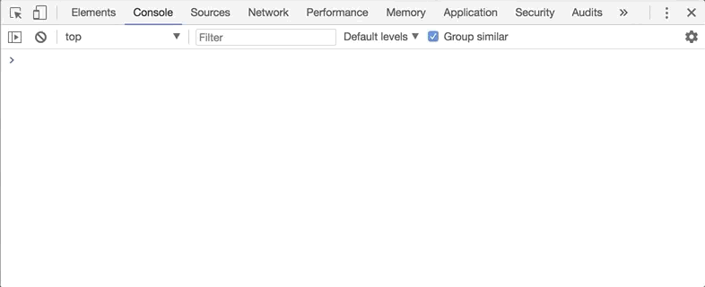

<h1 align="center">
  <br>
  🚀 Redux Enterprise
  <br>
  <br>
</h1>

<p align="center">
  <a href="https://travis-ci.org/redux-enterprise/redux-enterprise"></a>
  <a href="https://www.npmjs.com/package/redux-enterprise"></a>
  <a href="https://www.npmjs.com/package/redux-enterprise"></a>
  <a href="https://standardjs.com"></a>
</p>

### Overview

Library for scaling Redux based projects by promoting the use of consistent and standardized reducer and actions. As projects grow it quickly becomes critical to keep reducers lean, map actions to specific reducer handlers, and to standardize handling and naming for the typical best data structures found in redux.

#### Generate reducers actions and selectors from a data model
Redux Enterprise allows you to describe your core application state using a collection of high level data structures:
```js
import { Model, Types } from 'redux-enterprise'
const { Collection, Flag } = Types

Model({
  todos: {
    todos: Collection,
    isEditing: Flag
  },
  comments: Collection
})
```
#### Fully compatible with any Redux based project - gradually introduce consistency
The library generates reducers and actions that can seamlessly be introduced into existing Redux projects. The standardized actions are automatically available on the Actions object:
```js
import { Actions } from 'redux-enterprise'

Actions.Todos.isEditing.set()
Actions.Todos.todos.add({ id: 1, message: 'Hello Burp Morty' })
Actions.Todos.todos.upsert({ id: 1, message: 'Hello Morty' })
```

#### Automagic Rails-style REPL right in your browser console
When in dev mode Redux Enterprise also automagically provides an in-browser REPL for dispatching prebound actions or exploring data selectors:



### Installation

```sh
yarn add redux-enterprise
```


### Contributing

Please check out the [Contributing](https://github.com/redux-enterprise/redux-enterprise/blob/master/CONTRIBUTING.md) page to learn how to get involved. TLDR the [Github issues tab](https://github.com/redux-enterprise/redux-enterprise/issues) is your friend.

### Community

Feel free to tweet your questions, concerns, ideas, or appreciation to @alexfreska.
We also plan to create a Spectrum community chat.

